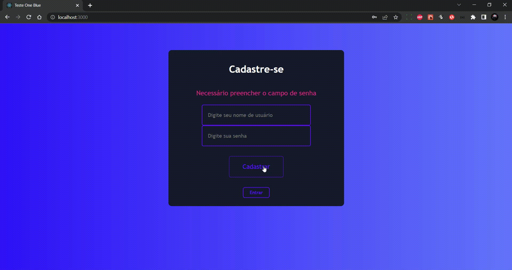
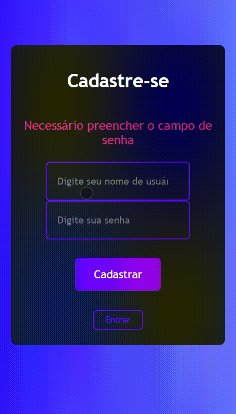

# **Teste-One-Blue**

Esta aplicação tem como função integrar com a aplicação backend presente neste
repositório (https://github.com/oneblueapp/testing_react_js) o objetivo desta
aplicação é uma interação visual com a API de cadastro de usuário e login do
mesmo. Com trativas de erros.

## **Instruções para o Backend**

- Clone este o projeto (https://github.com/oneblueapp/testing_react_js)
- No terminal rode o comando yarn / npm install (caso utilize npm)
- Após o download das dependências rode no terminal o comando: yarn start / npm
  start

  

## **Instruções para o FrontEnd**

- Clone o projeto
- No terminal rode o comando yarn / npm install (caso utilize npm)
- Após o download das dependências rode no terminal o comando: yarn start / npm
  start

  

## **Design Desktop**

## **Design Mobile**

## **Tecnologias**

### `React.js`

### `JavaScript`

### `Styled-Components`

### `Npm`

### `Jest`

### `Yup`
